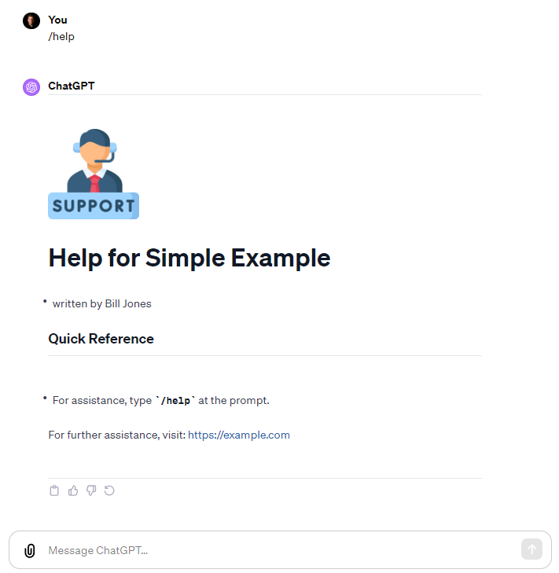

## Simple Memo Example

> Description: Starting pointy for a simple app "MEMO Writer".

- type `/memo` to write a Memo

- See actual ChatGPT session at:
  https://chat.openai.com/share/965fa701-5179-4a37-8946-a2b009819e4a

#### Screenshot



```yaml

company: Your Company Inc.
author: J. Jones
url: https://company.com

display_memo:
  - display section ':::memo' with images to user
  - replace placeholders with values
  - replace [[today]] with today's date
  - Trigger: '/memo'

convert_to_pdf:
  - convert the rendered HTML from ':::memo' to a PDF
  - provide a downloadable link to the PDF
  - Trigger: '/pdf'

:::Memo


---

# MEMO

[[today]]
## [company]
[url]

Dear Sam:

It was nice to meet you on [[today]].

Sincerely,
 [author]

---

```
