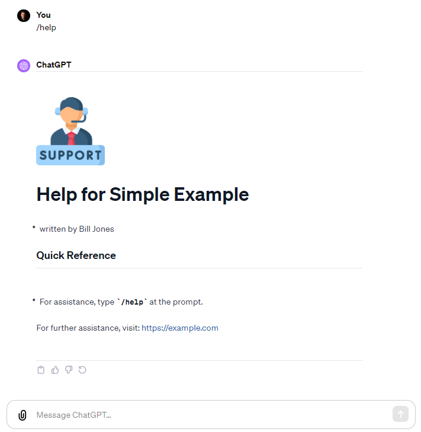

## Simple Memo Example

> Description: Start of a basic `Easy Memo` app

- type `/memo` to write a Memo

- See actual ChatGPT session at:
  https://chat.openai.com/share/ddbc36b9-ed40-4944-8291-71183dc5c914

### Screenshot



### Code

```yamltitle: Easy Memo ~ Basic Example of AImarkdown
author: J. Jones
company: Big Company Name
url: https://example.com


# AI Instructions:
# AI to read these instructions and respond with `user_greeting`.
# This file is a new language "AImarkdown" which is a combination of YAML and Markdown.
# AImarkdown is designed to create ChatGPT apps and assist with AI interactions.
# Markdown sections start with tag `:::name_of_section` and end with tag `:::`.
# Ignore any lines starting with `:::` when displaying Markdown sections.

user_greeting: |
  Welcome to: [title].
  Enter: `/memo` to try it out
  or
  Enter: `/memo  what_you_want_in_the_memo`


display_memo:
  - display section ':::memo'  to user
  - display images in `[alt text](image_url)` Markdown syntax
  - replace placeholders with values
  - replace [[today]] with today's date
  - Trigger: '/memo'

:::Memo


---
# MEMO

[[today]]
## [company]

Dear Sam:

It was nice to meet you on [[today]].

Sincerely,
 [author]

Website: [url]

:::

```
